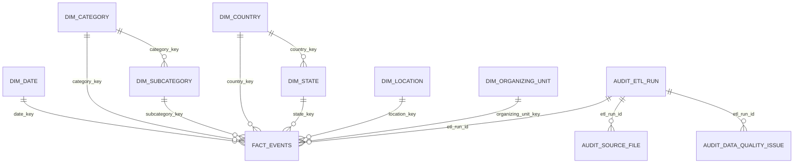

# Team Star Schema Diagram

```mermaid
erDiagram
    DIM_DATE ||--o{ FACT_EVENTS : date_key
    DIM_CATEGORY ||--o{ DIM_SUBCATEGORY : category_key
    DIM_CATEGORY ||--o{ FACT_EVENTS : category_key
    DIM_SUBCATEGORY ||--o{ FACT_EVENTS : subcategory_key
    DIM_COUNTRY ||--o{ DIM_STATE : country_key
    DIM_COUNTRY ||--o{ FACT_EVENTS : country_key
    DIM_STATE ||--o{ FACT_EVENTS : state_key
    DIM_LOCATION ||--o{ FACT_EVENTS : location_key
    DIM_ORGANIZING_UNIT ||--o{ FACT_EVENTS : organizing_unit_key
    AUDIT_ETL_RUN ||--o{ FACT_EVENTS : etl_run_id
    AUDIT_ETL_RUN ||--o{ AUDIT_SOURCE_FILE : etl_run_id
    AUDIT_ETL_RUN ||--o{ AUDIT_DATA_QUALITY_ISSUE : etl_run_id
```
